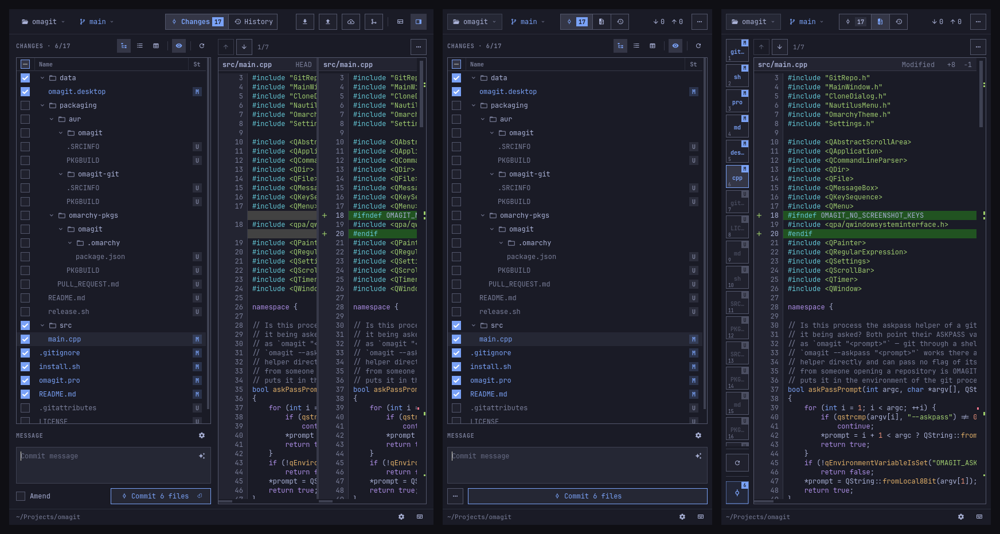
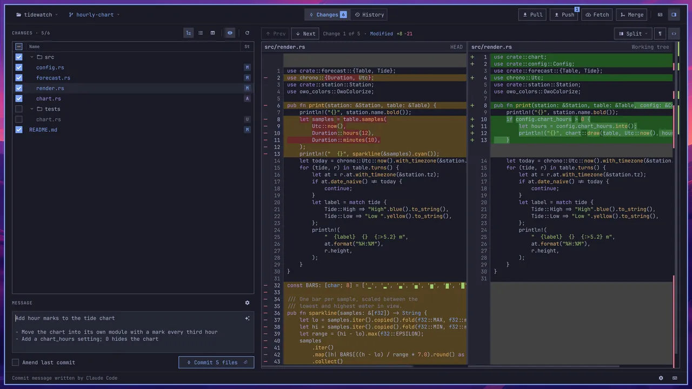
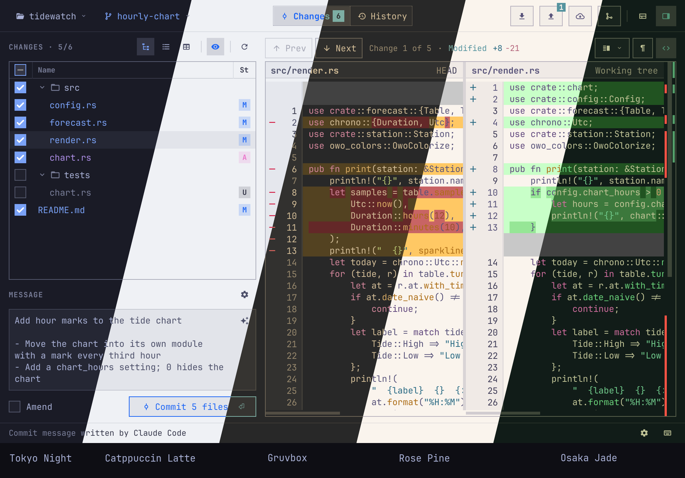

# Omagit

**An Omarchy-native git GUI designed for tiling window managers.**



Omagit stays usable in a tiling layout for as long as possible. As its tile shrinks,
labels turn into icons and less-used buttons move into a menu. In a narrow tile, it shows
one thing at a time: your changes, the diff or the history.



Omagit fits right into [Omarchy](https://omarchy.org). It follows your theme's colours,
fonts, text size and icons, and changes the moment you switch themes.



## What it does

- **Review & Commit:** See your changes as a tree, a list or a table. Read the diff side
  by side or in one column. Amend a commit or discard changes. Claude Code or Codex can
  write the commit message for you.
- **History:** Browse the full history with its branch graph. Search it and open any
  commit to see what changed.
- **Branches:** Switch branches and create new ones. A preview shows conflicts before
  you merge.
- **Sync:** Pull, push and fetch. Sign in to HTTPS and SSH remotes when asked,
  and save the sign-in in your keyring.
- **Repositories:** Reopen recent repositories. Clone from a URL or from your GitHub
  account. Open Omagit from Nautilus.

You can do everything from the keyboard. Press **Ctrl+K** to see all shortcuts.

## Install

On Omarchy, download the package from the latest release and install it:

```bash
curl -fLO https://github.com/liri2006/omagit/releases/latest/download/omagit-x86_64.pkg.tar.zst
sudo pacman -U omagit-x86_64.pkg.tar.zst
```

Run the same two lines again to update. `sudo pacman -R omagit` removes it. To build
Omagit yourself, see [Building from source](docs/development.md#building-from-source).

## License

MIT. See [LICENSE](LICENSE).
