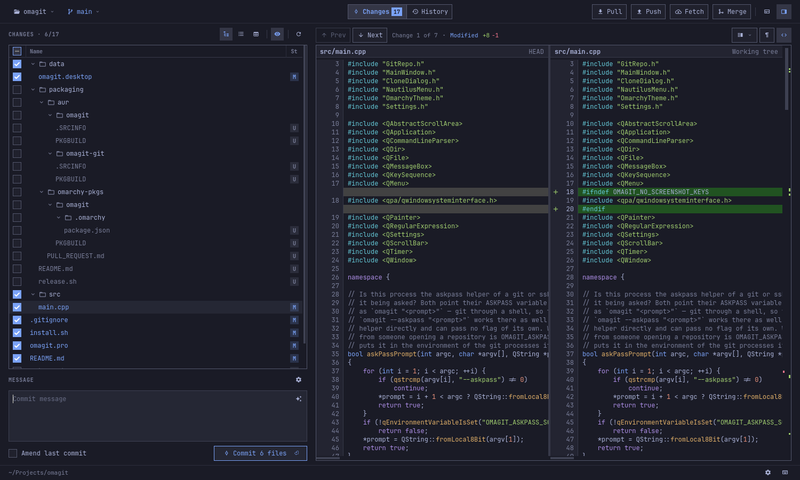
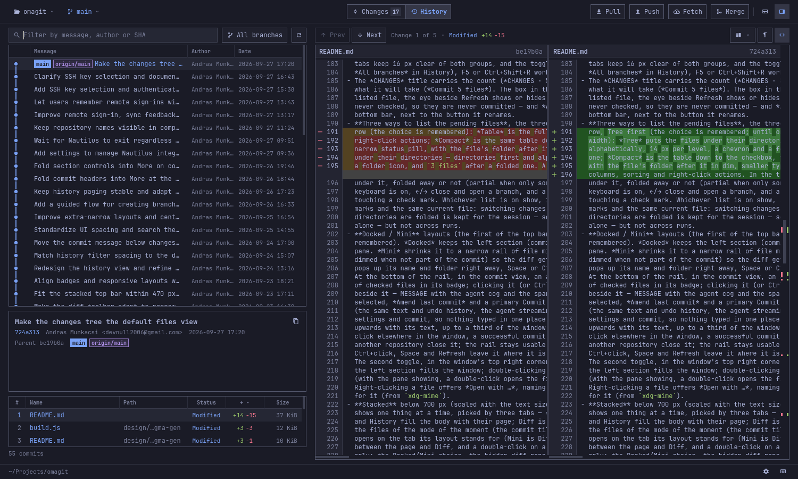

# Omagit

**An Omarchy-native git GUI, built for tiling window managers.**

On a tiling desktop a window rarely keeps its size. Open a browser next to Omagit and it
gets half the screen; open a terminal as well and it is down to a quarter. Omagit is made
for that. As its tile shrinks it rearranges itself instead of cutting things off: labels
turn into icons, less-used buttons move into a menu, and in a narrow tile it shows one
thing at a time — your changes, the diff or the history. Everything keeps working, and
when the window grows again the full layout comes back just as you left it.

It fits right into [Omarchy](https://omarchy.org): it takes its colours, fonts, text size
and icons from your Omarchy theme and follows theme changes as they happen, and its
keyboard shortcuts use lazygit's letters.




## What it does

- **Commit** — review your changes as a tree, a list or a table, read the diff side by
  side or in one column, amend or discard, and have Claude Code or Codex write the
  commit message if you like.
- **History** — browse the whole history with its branch graph, search it, and look at
  any commit's files and changes.
- **Branches** — switch and create branches, and merge with a preview that tells you
  beforehand whether the merge will conflict.
- **Sync** — pull, push and fetch, with sign-in for HTTPS and SSH remotes that can be
  remembered in your keyring.
- **Repositories** — reopen recent repositories, clone from a URL or from your GitHub
  account, and open Omagit from Nautilus.

Press **Ctrl+K** in Omagit to see every keyboard shortcut.



## Install

On Omarchy, from the AUR:

```bash
omarchy pkg aur add omagit
```

`omagit-git` follows the latest commit instead of the latest release. To build Omagit
yourself, see [Omagit in detail](docs/development.md#building-from-source).

## License

MIT — see [LICENSE](LICENSE).
